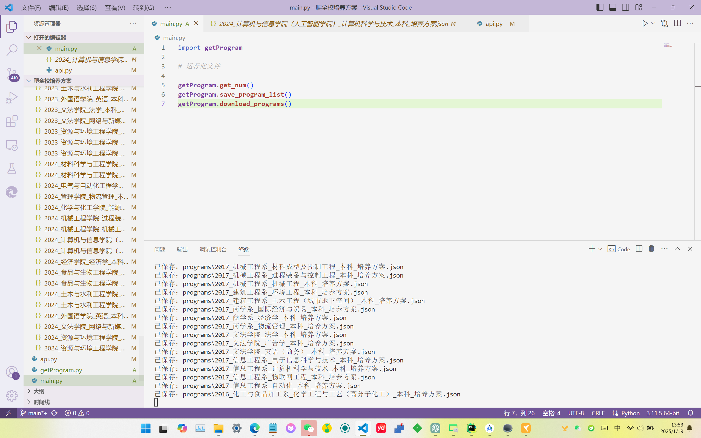

# 使用方法
【依赖安装】pip install requests

【必须配置】api.py中的auth变量，从【合工大教务】公众号-移动教务，抓包获取

【可选配置】api.py中的post_search_json中是用来筛选结果的，默认不用配置，获取全部方案，截止2025-01-19，有187份

运行main.py，即可自动下载培养方案JSON到文件夹，JSON可在聚在工大解析

# 合肥校区培养方案接入聚在工大

1.Fork并Clone 我的 Chiu-xaH.github.io 的仓库

2.使用脚本抓取后，将其文件夹programs中的两个项目放置到Chiu-xaH.github.io/program/hefei中

3.向我PR，合并请求后APP端即可查询到培养方案